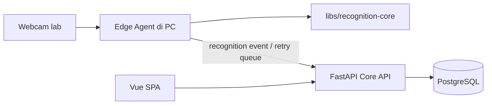
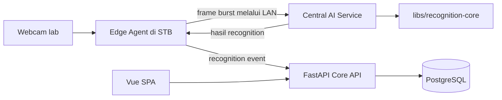

# Architecture overview

## Purpose and scope

Sistem mencatat presensi praktikum SMA Taruna Nusantara Kampus Cimahi. Rancangan awal menargetkan sekitar 900 siswa dan dua laboratorium. Pengalaman recognition mengutamakan walk-through multi-frame dengan fallback menghadap kamera ketika hasil ambigu atau kualitas frame belum cukup. Angka performa dan threshold adalah target yang harus divalidasi lewat benchmark lokal, bukan klaim awal.

Sistem mendukung dua deployment profile. Keduanya memakai satu Vue SPA, satu Core API/domain, satu PostgreSQL, dan satu recognition pipeline di `libs/recognition-core`. Perbedaan utamanya adalah lokasi pemrosesan frame.

## Komponen bersama

| Komponen | Tanggung jawab |
| --- | --- |
| `apps/web` | Vue 3 SPA untuk pengguna sekolah. Internal dashboard; tidak membutuhkan SSR/SEO. |
| `apps/api` | FastAPI Core API, OpenAPI contract, aturan session/roster/attendance, dan akses ke database. Ini otoritas domain. |
| PostgreSQL | Master data, session/roster, encrypted face-template vectors, recognition events, attendance records, dan audit. Embeddings disimpan sebagai AES-256-GCM ciphertext; pgvector tidak dipakai. |
| `libs/recognition-core` | Pipeline Python yang dapat dipanggil dari edge-agent atau AI service; bukan aplikasi web/API. |
| `apps/edge-agent` | Camera capture, health, cache, transport, dan offline queue sesuai profil. |
| `apps/ai-service` | Host inference untuk profil Central; menggunakan recognition-core, bukan salinan pipeline. |

`recognition_events` mencatat keluaran pengenalan. `attendance_records` hanya dibuat setelah Core API memvalidasi session aktif, roster snapshot, device, grace period, dan idempotency. Hasil AI yang ambigu harus menjadi retry/fallback, bukan otomatis menjadi presensi final.

## Profile A — AI di Edge PC (`AI_EDGE`)

Setiap laboratorium menghubungkan kamera UVC ke PC edge. Edge agent menjalankan pipeline dari `recognition-core` secara lokal, lalu mengirim recognition event ke Core API. Agent dapat memakai roster dan template untuk sesi aktif yang dicache. Saat API sementara tidak terjangkau, event disimpan dengan UUID idempotency key untuk dikirim ulang setelah koneksi pulih; final attendance tetap mengikuti validasi domain Core API.

Keunggulan profil ini untuk pilot dua lab adalah inference dan frame tetap di PC lab, latency transfer lebih rendah, serta recognition dapat terus berjalan sementara jika koneksi ke API putus dan cache masih valid. Biayanya adalah pemeliharaan runtime/model dan pemantauan setiap PC.

## Profile B — STB camera gateway + AI central (`STB_GATEWAY` + `AI_CENTRAL`)

STB ARM64 menjalankan agent ringan tanpa recognition model lokal. Konfigurasi contoh memakai capture UVC 640×360 pada 10 FPS, downsampled motion/quality gate, cooldown, dan periodic fallback. Gateway menemukan sesi aktif melalui Core API untuk laboratorium perangkat dan menolak kondisi lebih dari satu sesi aktif. Ketika ada kandidat, gateway mengirim paling banyak lima JPEG dalam burst melalui LAN tepercaya ke AI service pusat. AI service mengambil gallery sesi aktif dari Core API dengan kredensial perangkat, menjalankan pipeline `recognition-core` yang sama, lalu mengembalikan keputusan terbatas ke gateway untuk dikirim sebagai event ke Core API. Frame bersifat transient dan tidak disimpan secara default.

Profil ini memusatkan pengelolaan model dan mengurangi kebutuhan PC kuat per lab. Recognition memerlukan LAN dan server AI yang tersedia; frame wajah berpindah di jaringan lokal sehingga pengamanan transport dan akses perangkat diperlukan. Gallery AI Central disimpan di memory saja, dengan expiry dibatasi waktu cache dan jadwal. Kredensial perangkat dapat diperbarui otomatis jika token file dikonfigurasi dan diamankan; sistem operasi tetap perlu melindungi berkas itu.

## Batas domain dan aliran data

- Matching dibatasi pada roster sesi aktif bila memungkinkan; threshold harus dikalibrasi dari data uji lokal.
- Recognition memakai bukti beberapa frame dan margin Top-1/Top-2. Hasil ambigu meminta retry frontal.
- AI/edge mengirim recognition event dengan `event_id` stabil agar retry jaringan idempotent.
- Core API menolak event di luar sesi atau roster, mencegah presensi ganda, menentukan status hadir/terlambat, dan mencatat audit.
- Frame mentah diproses sementara dan tidak disimpan secara default. Embedding template disimpan sebagai ciphertext AES-256-GCM. Log dan respons operator tidak berisi gambar, embedding, token, password, atau secret; gallery berisi embedding terdekripsi hanya untuk perangkat terautentikasi pada sesi/lab aktif.
- Data biometrik siswa nyata/minor tidak digunakan di cloud/CI dan tidak dimasukkan ke repository.
- Template wajah menyimpan nama dan versi model. Pilihan model/pretrained weight memerlukan tinjauan lisensi dan validasi lokal sebelum dipakai.

## UI baseline: Gentelella + Vue

`apps/web` adalah satu-satunya aplikasi frontend: Vue 3 + Vite + TypeScript. Baseline visual dipin ke Gentelella v4.1.1. Gentelella dipakai untuk design tokens, SCSS, layout, iconography, dan pola komponen; perilaku UI dibangun sebagai komponen Vue agar Vue tetap mengelola DOM secara reaktif. Jangan menjalankan skrip vanilla template yang memutasi DOM milik Vue, jangan menambahkan dashboard/template frontend kedua, dan jangan mem-port semua halaman contoh.

UI ditujukan untuk dashboard internal yang responsif di desktop dan tablet. Navigasi hanya memuat halaman yang diimplementasikan, dengan visibilitas menu dan route guard berbasis role; form menampilkan validation/error state.

Sumber: [Gentelella getting started](https://gentelella.colorlib.com/docs/getting-started/) dan [repository ColorlibHQ](https://github.com/ColorlibHQ/gentelella). Pertahankan atribusi dan lisensi MIT ketika aset/template didistribusikan.

## Pilihan deployment awal

Desain v2 merekomendasikan pilot AI_EDGE karena saat ini hanya ada dua lab dan latency walk-through menjadi prioritas. AI_CENTRAL tetap menjadi profil yang didukung. Pilihan akhir harus dibandingkan pada hardware nyata melalui latency p50/p95, throughput, resource, biaya, dan kebutuhan operasional; angka asumsi tidak boleh ditulis sebagai hasil benchmark.

## Development environment

API v1 contract and frontend client generation follow the strategy in [api-contract.md](api-contract.md).

`docker-compose.yml` menjalankan PostgreSQL dan Core API secara default. PostgreSQL harus healthy sebelum API dimulai; healthcheck API memeriksa `/health`. AI service adalah service terpisah pada profile Compose `central`, dan web dapat dijalankan native untuk HMR atau sebagai service profile `web-container`. Edge agent/webcam tidak dijalankan di Compose karena akses kamera bergantung pada OS dan device passthrough.

Development Compose memakai `.env` lokal dari `.env.example`, mengekspos port hanya pada loopback, dan menyimpan data PostgreSQL di named volume. `scripts/dev.py` menyediakan `dev-up`, `dev-down`, dan `test` untuk Windows/Linux.

The native `AI_EDGE` and `STB_GATEWAY` agents, including their provider and
session-configuration limitations, are documented in [edge-agent.md](edge-agent.md).
Both remain outside default Compose because USB camera passthrough and driver
selection are host-specific.

The `AI_CENTRAL` inference contract, device authentication, bounded image handling,
and memory-only session cache lifecycle are documented in [ai-service.md](ai-service.md).

## Status implementasi dan pekerjaan tersisa

Skema PostgreSQL didefinisikan lewat SQLAlchemy 2 dan Alembic; migration dan seed role dijalankan eksplisit. API memakai Argon2, short-lived JWT operator, kredensial perangkat terpisah, permission checks, dan scope sumber daya pada handler yang sudah diimplementasikan. Attendance decision, sesi/roster, device gallery, enrollment dengan embedding terenkripsi, dan reporting tersedia. Beberapa operasi account/settings dan attendance listing tetap contract placeholder HTTP 501 setelah autentikasi/otorisasi; teacher correction saat ini hanya membuat permintaan pending dan belum memiliki approval workflow. Detail akses tercatat di [authentication.md](authentication.md) dan [api-contract.md](api-contract.md).

Threshold recognition belum dikalibrasi pada dataset/hardware sekolah. Penggunaan liveness tetap bergantung pada clearance lisensi model, dan akurasi/latency perangkat belum diverifikasi lewat field test fisik. Gallery lokal AI_EDGE berada di memory dan agent memerlukan koneksi baru setelah restart offline; event outbox tetap durable. Lihat [model provenance](../models.md), [field-test protocol](../test-plans/walkthrough-field-test.md), dan [deployment runbooks](../deployment/).
