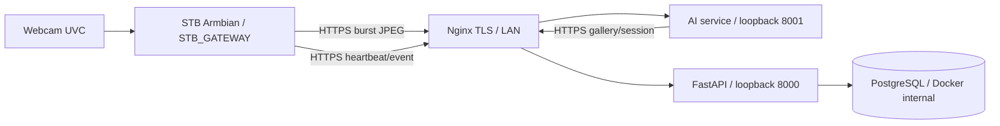

# Runbook deployment AI_CENTRAL + STB_GATEWAY

Panduan ini menyiapkan server FastAPI/PostgreSQL/AI Central dan STB ARM64
Armbian sebagai gateway kamera. Ganti seluruh hostname, alamat IP, commit, dan
placeholder sebelum menjalankan perintah.



Database tidak memiliki port host. API dan AI hanya bind ke loopback; STB
mengakses keduanya melalui Nginx TLS. Batasi host AI ke VLAN laboratorium dan
jaringan operator.

## 1. Tetapkan alamat LAN

Alamat di tabel adalah contoh RFC1918; sesuaikan dengan jaringan sekolah.
Utamakan DHCP reservation berdasar MAC agar alamat tetap.

| Perangkat | Contoh | Catatan |
| --- | --- | --- |
| Server | `192.168.40.10` | Reservasi IP; Nginx TCP 443 |
| Core API/Web | `attendance.example.edu` | DNS internal ke IP server; TLS valid |
| AI Central | `ai.attendance.example.edu` | DNS internal ke IP server yang sama |
| STB Lab 1 | `192.168.40.21` | Reservation MAC STB |
| STB Lab 2 | `192.168.40.22` | UUID device sendiri |

STB butuh DNS, NTP, HTTPS ke dua hostname. Batasi `ai.attendance.example.edu`
ke VLAN STB (mis. `192.168.40.0/24`) dan monitoring. Jangan buka port
PostgreSQL `5432`, API `8000`, atau AI `8001` ke Internet/LAN; SSH hanya dari
jaringan admin. Sediakan server Linux, board Armbian ARM64 yang didukung,
webcam UVC, kabel USB dan catu daya yang stabil. Profile STB tidak memuat model
YuNet/SFace.

## 2. Deploy server AI_CENTRAL

### 2.1 Source, model, dan secret

Checkout commit release yang telah ditinjau ke `/opt/presensi/server`. Pakai
rilis yang sama untuk API, AI, dan web; jangan deploy branch yang bergerak.
Gunakan deploy key read-only bila repo privat; jangan embed token Git di URL.

```bash
sudo install -d -o root -g root -m 0755 /opt/presensi
sudo git clone https://github.com/mygads/Face-Recognition-Capstone.git /opt/presensi/server
cd /opt/presensi/server
sudo git checkout --detach <reviewed-release-commit>
```

Letakkan model di luar Git/image. Bandingkan checksum dengan manifest artefak
yang disetujui sebelum mencatat hasil lokal:

```bash
sudo install -d -o root -g root -m 0755 /srv/presensi/models
cd /srv/presensi/models
sha256sum face_detection_yunet_2023mar.onnx face_recognition_sface_2021dec.onnx
```

Catat nama, versi, sumber, checksum tepercaya, tanggal, dan server. API
enrollment dan AI harus memakai file SFace serta versi yang sama dengan
`face_templates.model_version`; STB tidak menerima model wajah. Threshold wajib
berasal dari kalibrasi lokal—runbook tidak menetapkan angka production.

Copy template environment, ganti semua placeholder, dan kunci akses:

```bash
cd /opt/presensi/server
sudo cp infra/deployment/ai-central.env.example .env.ai-central
sudo chown root:root .env.ai-central
sudo chmod 0600 .env.ai-central
sudoedit .env.ai-central
```

Persiapan Docker Engine/Compose dan instalasi Nginx/TLS mengikuti
[prasyarat deployment AI_EDGE](ai-edge.md#1-deployment-prerequisites).
Pastikan utilitas GPG tersedia untuk backup terenkripsi:

```bash
gpg --version
```

Pin `POSTGRES_IMAGE` ke digest yang disetujui. Buat password berbeda untuk DB
owner/role aplikasi, `JWT_SECRET` acak minimal 32 byte, keyring AES-256-GCM
`PRESENSI_FACE_TEMPLATE_KEYS`, dan active key ID di dalam keyring. Simpan backup
rahasia/keyring di secret manager sekolah.

`PRESENSI_AI_CORE_API_BASE_URL` harus mengarah ke origin HTTPS Core API valid dan
dapat dicapai dari container (DNS LAN boleh menunjuk ke IP server privat).
Biarkan `PRESENSI_AI_DEVICE_TOKENS` kosong: AI memvalidasi credential/session
melalui Core API; jangan salin token STB ke env server. Isi threshold Top-1 dan
margin hanya dari evaluasi lokal legal. Liveness tetap nonaktif di contoh;
gunakan kontrol fisik/pengawasan yang disetujui sekolah hingga model liveness
mendapat clearance lisensi dan validasi tersendiri.

### 2.2 Build dan jalankan production Compose

Compose root adalah development-only (`--reload`). Production memakai Compose
base AI_EDGE (DB, API, role terbatas, migrator) dengan overlay AI Central. AI
memakai satu worker karena cache gallery, temporal state, limiter, dan metrics
berada dalam memori proses.

Jika berpindah dari pilot AI_EDGE, backup database dan keyring lama terlebih
dahulu. Compose AI_CENTRAL memakai nama project/volume baru; jangan menjalankan
dua stack dengan asumsi mereka otomatis berbagi database. Pulihkan dump AI_EDGE
ke DB AI_CENTRAL sesuai bagian 7 sebelum menerima sesi baru, atau pindahkan
volume secara terencana ketika kedua stack berhenti.

Dari root repo, definisikan helper untuk menjalankan kedua file production:

```bash
cd /opt/presensi/server
dc() {
  sudo docker compose --project-name presensi-ai-central \
    --env-file .env.ai-central --project-directory "$PWD" \
    -f infra/deployment/compose.ai-edge.yml \
    -f infra/deployment/compose.ai-central.yml "$@"
}
```

Biarkan `API_PORT=8000` dan `AI_SERVICE_PORT=8001` pada environment contoh,
karena upstream reverse proxy di bawah mengarah ke port tersebut. Jika port
diubah, perbarui proxy upstream dan health/monitoring command secara bersamaan.

Validasi, build, dan mulai DB; tunggu `healthy`:

```bash
dc config --quiet
dc build api ai-service
dc up -d db
dc ps
```

Terapkan schema/seed, buat ADMIN pertama melalui prompt password tersembunyi,
lalu jalankan API dan AI:

```bash
dc --profile ops run --rm migrate
dc run --rm api python -m presensi_api.db.seed_roles
dc run --rm -it api python -m presensi_api.auth.create_user \
  --email admin@example.edu --full-name "School Administrator" --role ADMIN
dc up -d api ai-service
dc ps
dc exec -T db sh -ec 'pg_isready -U "$POSTGRES_USER" -d "$POSTGRES_DB"'
curl --fail --show-error https://attendance.example.edu/health
curl --fail --show-error https://ai.attendance.example.edu/health
```

`/health` mengecek process, bukan query DB/recognition; `pg_isready` harus
menerima koneksi. Pasang Vue static build dan host Core API sesuai
[runbook AI_EDGE bagian reverse proxy](ai-edge.md#5-build-vue-and-configure-nginx).

### 2.3 Nginx dan firewall

Gunakan sertifikat TLS valid. Di konteks Nginx `http`, tambahkan `map` dan access
log tanpa body/header Authorization:

```nginx
map $http_upgrade $connection_upgrade {
    default upgrade;
    ''      close;
}
log_format presensi_safe '$remote_addr [$time_local] "$request_method $uri $server_protocol" '
                         '$status $body_bytes_sent';
```

Host Core API/Web mengikuti runbook AI_EDGE. Tambahkan virtual host AI; ubah nama
DNS/subnet sesuai LAN. `/metrics` hanya boleh dari monitoring; jangan expose docs
atau OpenAPI:

```nginx
server {
    listen 443 ssl;
    server_name ai.attendance.example.edu;
    # Certificate must cover this AI hostname and the Core hostname.
    ssl_certificate /etc/letsencrypt/live/attendance.example.edu/fullchain.pem;
    ssl_certificate_key /etc/letsencrypt/live/attendance.example.edu/privkey.pem;
    client_max_body_size 22m;
    access_log /var/log/nginx/presensi-ai.access.log presensi_safe;
    allow 192.168.40.0/24; # VLAN STB
    deny all;

    location = /health {
        proxy_pass http://127.0.0.1:8001/health;
        proxy_set_header Host $host;
    }
    location = /metrics {
        allow 192.168.10.15; # monitoring host yang disetujui
        deny all;
        proxy_pass http://127.0.0.1:8001/metrics;
        proxy_set_header Host $host;
    }
    location ~ ^/api/v1/recognition/sessions/[0-9a-fA-F-]+/(bursts|cache)$ {
        limit_except POST DELETE { deny all; }
        proxy_pass http://127.0.0.1:8001;
        proxy_http_version 1.1;
        proxy_set_header Host $host;
        proxy_set_header X-Real-IP $remote_addr;
        proxy_set_header X-Forwarded-For $remote_addr;
        proxy_set_header X-Forwarded-Proto $scheme;
        proxy_read_timeout 30s;
        proxy_send_timeout 30s;
    }
    location / { return 404; }
}
```

```bash
sudo nginx -t
sudo systemctl reload nginx
sudo ss -lntp | grep -E ':(5432|8000|8001|443)\b'
```

Tidak boleh ada listener host `5432`; `8000`/`8001` hanya loopback; jaringan
hanya masuk melalui `443` sesuai allowlist. Dari VLAN STB, DNS mengarah ke IP LAN
server dan sertifikat HTTPS tervalidasi.

## 3. Daftarkan dan provision credential STB

Untuk tiap STB, ADMIN membuat device di `/app/devices` bertipe `camera_gateway`,
profile `STB_GATEWAY`, lab yang tepat. Catat UUID, hostname, MAC, IP reservation,
posisi kamera, dan rilis.

UI belum mempunyai aksi credential satu-kali. Dari workstation operator, buat
SSH tunnel ke API loopback (jangan expose `/docs`):

```bash
ssh -N -L 18000:127.0.0.1:8000 admin@attendance-server.example.edu
```

Dalam sesi tunnel, buka `http://127.0.0.1:18000/docs`, authorize sebagai ADMIN,
lalu jalankan `POST /api/v1/devices/{device_id}/credentials`. Respons memberi
token raw sekali saja. Jangan salin token ke chat, shell argument, screenshot,
tiket, log, atau env Compose. Bagian 5 memasangnya ke token file STB. Token yang
sama dipakai API dan AI, lalu diperbarui otomatis saat heartbeat mendekati
expiry. Jika token hilang, ADMIN dapat membuat token baru melalui
`POST /api/v1/devices/{device_id}/credentials/rotate`; STB pengganti perlu UUID
dan credential baru, jangan clone identitas.

## 4. Siapkan STB Armbian baru

Unduh image ARM64 yang cocok dengan board persis, verifikasi integritas sesuai
petunjuk upstream, lalu flash dengan Armbian Imager. Image minimal/CLI cukup.
Ikuti panduan resmi [menulis image](https://docs.armbian.com/getting-started/writing-the-image/)
dan [first boot](https://docs.armbian.com/getting-started/first-boot-and-login/).
Pada first boot, ganti password awal dan buat akun admin lokal; jangan biarkan
akses default.

Armbian minimal/server adalah baseline yang didokumentasikan karena agent
berjalan sebagai service systemd native dan tidak memerlukan desktop/container
dashboard. Periksa daftar board dan image yang masih didukung pada situs resmi
[Armbian](https://docs.armbian.com/getting-started/choosing-an-image/) sebelum
memilih image. CasaOS bukan sistem operasi yang diperlukan oleh agent; bila STB
sudah memakai CasaOS, pastikan OS dasar, Python, UVC/V4L2, permission kamera,
dan reboot service benar-benar bekerja pada board itu. CasaOS menjadi lapisan
dashboard opsional, bukan bagian runtime yang diuji repository ini. Lihat
[dukungan upstream CasaOS](https://github.com/IceWhaleTech/CasaOS) dan tetap
gunakan unit systemd edge-agent dari repository.

Hubungkan Ethernet kabel, update OS, pasang OpenCV/V4L2 diagnostics, dan set
waktu. Project memerlukan Python 3.11+; jika image board lebih lama, gunakan
image Armbian didukung dengan Python yang memenuhi syarat.

```bash
sudo apt update
sudo apt full-upgrade -y
sudo apt install -y ca-certificates git python3 python3-venv python3-pip \
  python3-opencv python3-numpy v4l-utils sysstat
sudo timedatectl set-timezone Asia/Jakarta
sudo timedatectl set-ntp true
python3 --version
timedatectl status
```

### 4.1 LAN, DNS, NTP, TLS

Minta admin jaringan membuat DHCP reservation berdasar MAC dan internal DNS
untuk Core/AI. Verifikasi alamat, route, DNS, dan sinkronisasi:

```bash
ip -br link
ip -br address
ip route
resolvectl status
getent hosts attendance.example.edu ai.attendance.example.edu
timedatectl show -p NTPSynchronized --value
```

Jika harus memakai static IP, Armbian modern memakai Netplan dengan renderer
bergantung image. Tinjau `/etc/netplan`, siapkan console access, ikuti
[panduan networking Armbian](https://docs.armbian.com/user-guide/networking/),
dan uji `sudo netplan try`. Jangan salin interface/gateway contoh.

```bash
curl --fail --show-error https://attendance.example.edu/health
curl --fail --show-error https://ai.attendance.example.edu/health
```

Gunakan DNS name sesuai certificate. Jangan memakai `curl -k` atau HTTP
cleartext. Untuk private CA, pasang CA root melalui prosedur IT dan pastikan
client Python mempercayainya.

### 4.2 Webcam test

Pasang kamera di posisi akhir lalu periksa device dan mode UVC:

```bash
v4l2-ctl --list-devices
ls -l /dev/video*
sudo v4l2-ctl --device=/dev/video0 --all
sudo v4l2-ctl --device=/dev/video0 --list-formats-ext
```

Ganti device node sesuai output. Uji capture 100 frame 640×360 ke `/dev/null`
agar tidak ada frame yang tersimpan:

```bash
sudo v4l2-ctl --device=/dev/video0 \
  --set-fmt-video=width=640,height=360,pixelformat=MJPG \
  --stream-mmap=3 --stream-count=100 --stream-to=/dev/null
```

Lulus jika command selesai tanpa error dan kamera membaca 100 frame. Jika MJPG
tidak didukung, pilih format/ukuran dari `--list-formats-ext` dan samakan
config. Enumerasi aplikasi harus menampilkan index kamera:

```bash
presensi-edge-agent --config /etc/presensi-edge-agent/stb-gateway.yaml cameras
```

Ini memverifikasi capture dasar; setelah unit berjalan, cek log
`gateway_camera_opened` dan camera status di dashboard. Tidak perlu mengambil
atau menyimpan foto wajah.

## 5. Install STB_GATEWAY systemd

### 5.1 Source release dan akun service

Gunakan commit yang sama dengan server dan simpan tiap rilis terpisah agar
rollback sederhana:

```bash
RELEASE_ID=<reviewed-tag-or-commit>
sudo install -d -o root -g root -m 0755 /opt/presensi-edge-agent/releases
sudo git clone https://github.com/mygads/Face-Recognition-Capstone.git \
  "/opt/presensi-edge-agent/releases/$RELEASE_ID"
sudo git -C "/opt/presensi-edge-agent/releases/$RELEASE_ID" \
  checkout --detach "$RELEASE_ID"
RELEASE="/opt/presensi-edge-agent/releases/$RELEASE_ID"
```

Ganti placeholder dengan tag/commit yang disetujui. Buat akun non-admin,
virtualenv yang memakai OpenCV/Numpy apt packages, dan symlink rilis aktif:

```bash
sudo useradd --system --no-create-home \
  --home-dir /var/lib/presensi-edge-agent \
  --shell /usr/sbin/nologin presensi-edge
sudo usermod -aG video presensi-edge
sudo install -d -o root -g presensi-edge -m 0750 /etc/presensi-edge-agent
sudo python3 -m venv --system-site-packages "$RELEASE/.venv"
sudo "$RELEASE/.venv/bin/pip" install -e "$RELEASE/apps/edge-agent"
sudo ln -sfn "$RELEASE" /opt/presensi-edge-agent/current
```

Systemd menambahkan group `video`. State writable hanya di
`/var/lib/presensi-edge-agent` untuk credential renewal dan SQLite event
metadata; frame/embedding tidak ditulis.

### 5.2 Config dan secret per perangkat

Salin YAML ke `/etc`, atur DNS, camera index, dan burst settings sesuai webcam
test. Sample memakai 640×360/10 FPS dan quality gate ringan; jangan pasang model
wajah di STB.

```bash
sudo install -o root -g presensi-edge -m 0640 \
  "$RELEASE/apps/edge-agent/config/stb-gateway.example.yaml" \
  /etc/presensi-edge-agent/stb-gateway.yaml
sudoedit /etc/presensi-edge-agent/stb-gateway.yaml
```

File env berisi UUID saja:

```bash
sudo install -o root -g root -m 0600 /dev/null \
  /etc/presensi-edge-agent/agent.env
sudoedit /etc/presensi-edge-agent/agent.env
```

```ini
PRESENSI_EDGE_DEVICE_ID=<registered-device-uuid>
```

Pasang credential hasil provision sekali. Prompt tersembunyi dan isi token
mengalir melalui stdin ke `tee`, bukan sebagai argument:

```bash
sudo install -d -o presensi-edge -g presensi-edge -m 0750 \
  /var/lib/presensi-edge-agent
sudo -u presensi-edge install -m 0600 /dev/null \
  /var/lib/presensi-edge-agent/device.token
read -r -s -p 'Paste one-time device credential: ' DEVICE_TOKEN
printf '\n'
printf '%s\n' "$DEVICE_TOKEN" | sudo -u presensi-edge tee \
  /var/lib/presensi-edge-agent/device.token >/dev/null
unset DEVICE_TOKEN
sudo stat -c '%U:%G %a %n' /var/lib/presensi-edge-agent/device.token
```

Owner/mode yang benar `presensi-edge:presensi-edge 600`. File harus writable
oleh service agar heartbeat dapat mengganti token secara atomik mendekati
expiry. Config/env hanya dibaca service; token/outbox hanya dapat ditulis oleh
service.

### 5.3 Install dan mulai unit

```bash
sudo -u presensi-edge "$RELEASE/.venv/bin/presensi-edge-agent" \
  --config /etc/presensi-edge-agent/stb-gateway.yaml cameras
sudo install -o root -g root -m 0644 \
  "$RELEASE/apps/edge-agent/deploy/presensi-stb-gateway.service" \
  /etc/systemd/system/presensi-edge-agent.service
sudo systemd-analyze verify /etc/systemd/system/presensi-edge-agent.service
sudo systemctl daemon-reload
sudo systemctl enable --now presensi-edge-agent.service
sudo systemctl status --no-pager presensi-edge-agent.service
sudo journalctl -u presensi-edge-agent.service -n 100 --no-pager
```

Expected: `active (running)`, log `edge_agent_starting` profile `STB_GATEWAY`,
kemudian `gateway_camera_opened`. Log tidak boleh memuat frame, embedding,
password, token, atau body request. systemd menghidupkan ulang process setelah
failure/reboot.

## 6. Health monitoring dan troubleshooting

### Server

Jalankan helper `dc` dari bagian 2:

```bash
dc ps
dc exec -T db sh -ec 'pg_isready -U "$POSTGRES_USER" -d "$POSTGRES_DB"'
dc logs --since 15m api ai-service db
curl --fail --show-error https://attendance.example.edu/health
curl --fail --show-error https://ai.attendance.example.edu/health
```

`/health` hanya memastikan process menjawab. `pg_isready` mengecek database;
commission recognition dengan sesi uji dan orang dewasa relawan/fixture yang
disetujui sekolah. `/metrics` memberi aggregate request/error/timeout, p50/p95,
CPU/RAM process dan host. Batasi aksesnya ke monitoring; jangan tambahkan label
student/device atau scrape dari Internet.

Dashboard ADMIN `/app/devices` menunjukkan status heartbeat, camera status,
assignment, dan versi agent. Heartbeat tiap 15 detik; server menandai offline
setelah timeout default 60 detik. Versi model/threshold berada pada AI server;
STB tidak mengirim model recognition lokal.

### STB

```bash
ip -br address
timedatectl status
sudo systemctl status --no-pager presensi-edge-agent.service
sudo journalctl -u presensi-edge-agent.service --since '15 minutes ago' --no-pager
v4l2-ctl --list-devices
sudo stat -c '%U:%G %a %n' /var/lib/presensi-edge-agent/device.token
```

Gunakan enumerasi kamera, health TLS Core/AI, log systemd, heartbeat dashboard,
dan `/metrics` dari jaringan operator. Subcommand CLI `status` tidak dijadikan
acceptance gate deployment central.

Saat commissioning, catat beban aktual per board dan server; jangan mengarang
angka sebelum perangkat ada. Pada STB, `sysstat` menyediakan process CPU/RSS dan
sysfs dapat menunjukkan sensor suhu yang tersedia:

```bash
PID=$(systemctl show --property=MainPID --value presensi-edge-agent.service)
pidstat -u -r -p "$PID" 1 300
for sensor in /sys/class/thermal/thermal_zone*/temp; do
  [ -r "$sensor" ] && printf '%s ' "$sensor" && cat "$sensor"
done
```

Di server, pakai `dc stats api ai-service db` dan AI `/metrics` untuk process/host
resource, latency, timeout, dan error. Tetapkan batas per board melalui field
test yang disetujui; metrik agregat bukan benchmark akurasi.

| Gejala | Pemeriksaan |
| --- | --- |
| STB offline | DHCP reservation, route/DNS/NTP/TLS, UUID aktif, token permissions, service log |
| Camera warning | USB/power, `/dev/video*`, group `video`, index, mode, kabel/hub |
| AI 401 | Credential, clock, device aktif, DNS Core API, issuer TLS |
| AI 409 | Sesi lab sudah dibuka dan hanya ada satu sesi aktif |
| Gallery unavailable | Template enrolled pada model/version sama; Core, keyring, roster, dan LAN |
| AI timeout | `/metrics`, CPU/RAM server, ukuran burst, packet loss; jangan longgarkan limit tanpa uji |
| Credential renewal gagal | Owner/mode token, NTP, audit API; rotate jika expired |
| Event dead-letter | Tinjau status error tanpa membuka payload; cek session/roster/clock sebelum replay |

Frame burst hanya di memori. Jika AI tidak terjangkau, gateway tidak membuat
recognition baru dan tidak menyimpan frame. Jika Core API putus tetapi AI masih
hidup dengan gallery/session grant tervalidasi, event hasil AI yang sudah dibuat
masuk SQLite outbox sebagai metadata dan dicoba ulang FIFO. Cache berakhir pada
session end atau umur maksimum (default 300 detik), mana lebih dahulu. Core API
tetap menolak event yang tak lagi memenuhi session/roster rule; tinjau
dead-letter/rejected sebelum melanjutkan presensi.

## 7. Backup dan restore server

Ambil backup harian dan sebelum upgrade. Contoh berikut menghasilkan dump custom
terenkripsi GPG. Simpan hanya ciphertext di lokasi terpisah; passphrase dan
keyring template disimpan di secret manager. Lakukan restore drill berkala.

```bash
set -o pipefail
STAMP=$(date -u +%Y%m%dT%H%M%SZ)
BACKUP_DIR=/srv/backups/presensi
install -d -m 0700 "$BACKUP_DIR"
dc exec -T db sh -ec \
  'pg_dump --format=custom --no-owner --no-privileges --username="$POSTGRES_USER" --dbname="$POSTGRES_DB"' \
  | gpg --symmetric --cipher-algo AES256 \
      --output "$BACKUP_DIR/presensi-$STAMP.dump.gpg"
sha256sum "$BACKUP_DIR/presensi-$STAMP.dump.gpg"
gpg --decrypt "$BACKUP_DIR/presensi-$STAMP.dump.gpg" | pg_restore --list >/dev/null
```

Restore mengganti seluruh database. Pilih dump dan source/config/keyring release
pasangan, lalu minta operator kedua mengonfirmasi target sebelum mulai:

```bash
set -o pipefail
BACKUP=/srv/backups/presensi/<selected-backup>.dump.gpg
dc stop api ai-service
dc exec -T db sh -ec \
  'dropdb --if-exists --username="$POSTGRES_USER" --maintenance-db=postgres "$POSTGRES_DB" && createdb --username="$POSTGRES_USER" --owner="$POSTGRES_USER" "$POSTGRES_DB"'
dc exec -T db sh /docker-entrypoint-initdb.d/10-create-api-role.sh
gpg --decrypt "$BACKUP" | dc exec -T db sh -ec \
  'pg_restore --no-owner --no-privileges --exit-on-error --username="$POSTGRES_USER" --dbname="$POSTGRES_DB"'
dc --profile ops run --rm migrate current
dc up -d api ai-service
dc ps
```

Pastikan restore/schema, API/AI health, login ADMIN, dan heartbeat device sebelum
sesi baru dibuka. Untuk backup schema lama, validasi target migration dahulu.
Tanpa seluruh keyring lama, encrypted template tidak dapat dipakai. Rekonsiliasi
attendance setelah waktu backup mengikuti policy koreksi/audit sekolah.

## 8. Prosedur penggantian STB

1. Jika STB lama masih dapat diakses, hentikan service dan tunggu outbox terkirim;
   tinjau dead-letter. Jangan salin SQLite ke STB baru karena event terikat ke
   `device_id` lama.
2. Jika unit hilang/rusak, tandai insiden aset dan nonaktifkan device lama di
   `/app/devices` agar credential tidak valid. Rotasi jika token mungkin bocor.
3. Flash board pengganti dari awal sesuai bagian 4. Ubah DHCP reservation ke MAC
   baru dan catat serial, hostname, IP, dan lab.
4. Daftarkan device baru (`camera_gateway`, `STB_GATEWAY`, lab yang sama), catat
   UUID baru, dan provision token baru satu kali. Jangan clone token, env, atau
   outbox.
5. Pasang rilis dan config di bagian 5; jalankan acceptance checklist di bawah
   sebelum lab kembali beroperasi.
6. Setelah data queue lama direkonsiliasi dan tidak dibutuhkan untuk investigasi,
   wipe media mengikuti retensi sekolah dan catat operator/tanggal/UUID lama.

Jika outbox lama perlu dipulihkan, pertahankan unit/media lama dan sinkronkan
dengan UUID/credential lama atas persetujuan ADMIN; jangan pasang outbox lama di
UUID baru. Setelah selesai, nonaktifkan device lama.

## 9. Acceptance checklist

Isi untuk tiap board/image/kamera/lab. Pakai sesi uji dan data sintetis atau
volunteer dewasa yang disetujui. Jangan simpan foto di form. Setiap item wajib
lulus atau memiliki blocker/owner sebelum sistem dipakai siswa.

### Setelah fresh install

- [ ] Image ARM64 cocok board; password awal diubah; update OS diterapkan.
- [ ] DHCP reservation, route, DNS, NTP/timezone tepat; TLS Core dan AI valid
      tanpa menonaktifkan certificate verification.
- [ ] Dari STB tidak dapat mengakses host port `5432`, `8000`, atau `8001`.
- [ ] Kamera UVC terdeteksi dan membaca 100 frame pada mode yang dikonfigurasi;
      mount/pencahayaan cukup.
- [ ] Device UUID/lab/profile cocok; token tidak ada di repo/log/tiket dan file
      owner `presensi-edge`, mode `0600`.
- [ ] `systemd-analyze verify` sukses; service `active (running)` dan log kamera
      terbuka tanpa restart loop/secret.
- [ ] Dashboard device online/camera online dalam 60 detik; AI `/health` sukses;
      metrics hanya terbuka untuk monitoring allowlist.
- [ ] Sesi uji membuktikan alur camera → STB → AI → Core API; tidak ada frame atau
      embedding di disk/log/response operasional dan tidak ada duplicate record.
- [ ] Selesaikan seluruh checklist **setelah reboot**.

### Setelah reboot

- [ ] STB kembali memperoleh reserved IP dan NTP sinkron.
- [ ] Service otomatis aktif tanpa login dan membuka kamera.
- [ ] Heartbeat/dashboard kembali online dalam ≤60 detik setelah jaringan siap.
- [ ] UUID, token file, dan SQLite outbox tetap ada dengan permission benar;
      tidak ada error credential renewal.
- [ ] Session aktif ditemukan; session tertutup/expired tidak dimulai lagi.
- [ ] Satu transaksi test yang disetujui berjalan; API tidak membuat presensi ganda.

### Setelah network reconnect

- [ ] Catat waktu putus/pulih dan endpoint yang diuji. Agent tetap hidup saat
      layanan gagal, tidak menulis frame, dan melanjutkan retry.
- [ ] Bila Core API saja putus sementara AI hidup, cached grant/gallery yang
      tervalidasi masih digunakan hanya sampai expiry; event yang diputuskan AI
      masuk outbox. Setelah cache expired, pengenalan fail-closed.
- [ ] Bila seluruh akses AI putus, tidak ada recognition baru; frame offline
      tidak disimpan atau diproses belakangan.
- [ ] Setelah LAN/DNS/TLS pulih, heartbeat dan discovery kembali jalan tanpa
      reset secret; dashboard online dalam ≤60 detik.
- [ ] Event outbox valid terkirim FIFO dengan `event_id` sama, tanpa duplicate
      final attendance. Tinjau dead-letter/rejected dan session yang tutup.
- [ ] Sesi uji baru kembali melakukan alur kamera → AI → API; catat hasil/jumlah,
      jangan catat wajah atau embedding.

Jika board, kamera, server, atau jaringan nyata tidak tersedia saat setup,
statusnya **MANUAL HARDWARE TEST REQUIRED**; jangan menyatakan deployment
diterima sebelum pemeriksaan perangkat fisik dan TLS LAN lulus.
